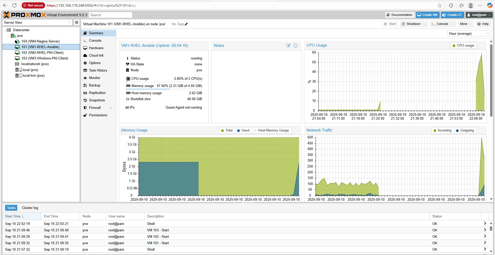

# PKI Simulation Project

**Overview**

This project simulates a Public Key Infrastructure (PKI) environment that includes:
- Root and Intermediate CAs (on Linux)
- Linux & Windows clients configured to trust the CA
- Automation via Ansible
- CI/CD pipeline example for GitLab
- Nagios monitoring configuration and checks

**Objectives**
- Deploy Root & Intermediate CAs
- Automate certificate issuance to Linux and Windows clients with Ansible
- Use GitLab CI/CD for deployment automation
- Monitor certificate status and service health via Nagios

**Lab Topology**

Network: `10.0.0.0/24` (private)
- VM1 (10.0.0.10) — RHEL 10 — Root CA & Ansible Control Node
- VM2 (10.0.0.11) — RHEL 10 — Linux PKI Client
- VM3 (10.0.0.12) — Windows Server 2022 — Windows PKI Client
- VM4 (10.0.0.13) — Ubuntu 24.04 LTS — Nagios Monitoring Server
- GitLab — CI/CD server



**Quick-start**
1. Provision VMs in Proxmox/VirtualBox as described in `docs/VM_SETUP.md`.
2. Copy the `ca/` directory to the Root CA VM: `/root/ca/`.
3. Run Ansible from the Control Node: `ansible-playbook -i inventory.yml playbooks/pki-automation.yml`.
4. Import the CA certificate on Windows client as documented below.
5. Configure GitLab with the included `.gitlab-ci.yml` for automated runs.

**What's in this repo**
- `playbooks/` — Ansible playbooks for PKI tasks
- `inventory.yml` — Ansible inventory example
- `ca/` — CA directory layout with example files and scripts to create Root/Intermediate
- `gitlab/` — example `.gitlab-ci.yml`
- `nagios/` — example Nagios config and check scripts
- `docs/` — step-by-step lab instructions

See `docs/` for step-by-step instructions and detailed commands.

## Security safeguards

This repo includes several safeguards to help prevent accidental commits of private keys:

- `.gitattributes` marks private key directories to be excluded from `git archive` exports.
- `.githooks/pre-commit` is a **local** pre-commit hook template that scans staged files for PEM private keys or filenames in `private/` directories. To enable it locally:
  ```
  chmod +x .githooks/pre-commit
  ln -s ../../.githooks/pre-commit .git/hooks/pre-commit
  ```
  (Git hooks are not shared via the repository by default; each contributor should set this up locally.)

- A GitHub Actions workflow (`.github/workflows/scan-and-deploy.yml`) scans the repository on push/PR for private key material and fails the run if it finds any. It also runs the Ansible playbook in `--check` (dry-run) mode.

Important: CI checks and hooks are helpful, but **do not** replace proper secrets management. Use Vault, GitHub/GitLab CI variables, or other secret stores for private keys and passwords.

## Vault integration & secure secret handling

This repo provides a small demo script and Ansible hardening to keep CA private keys out of the repository.

### Upload CA to HashiCorp Vault (KV)
Use the included helper to upload the CA cert and private key to Vault (KV v2):

```
export VAULT_ADDR='https://vault.example.local:8200'
export VAULT_TOKEN='s.xxxxx'
./scripts/vault_upload.sh --cert /path/to/ca/certs/ca.cert.pem --key /path/to/ca/private/ca.key.pem
```

The script uses `vault kv put secret/pki/ca ca_cert=@/path/to/ca.cert.pem ca_key=@/path/to/ca.key.pem` by default.
Ensure to create a Vault policy that restricts read access to the `secret/pki/ca` path.

### Ansible changes (fetching CA from Vault or CI env)
The Ansible playbook `playbooks/pki-automation.yml` was updated to:
- Check for `VAULT_ADDR` and `VAULT_TOKEN` environment variables and, if present, fetch CA data from Vault's KV v2 at `secret/data/pki/ca`.
- Fallback to CI environment variables `CI_CA_CERT_BASE64` and `CI_CA_KEY_BASE64` (base64-encoded) when running in CI (GitHub/GitLab) and write them to target hosts.
- As a last resort, it can use the placeholder `playbooks/files/ca.cert.pem` (not recommended).

#### Example CI usage (GitHub Actions)
Add repository secrets `CI_CA_CERT_BASE64` and `CI_CA_KEY_BASE64` containing base64-encoded values of the CA cert and key (if absolutely necessary).
The provided GitHub Action (`.github/workflows/scan-and-deploy.yml`) will run the playbook in `--check` mode and will read these env vars if set in Actions' secrets.

**Security note:** Prefer Vault or a proper secrets manager. Avoid storing private keys in CI secrets unless they have strong protections and are rotated frequently.

## 🔐 Security Enhancements
- **GitLeaks Action**: Scans all Pull Requests for secrets (does not block pushes).
- **Vault Policy**: Example `vault/policies/pki-policy.hcl` grants read-only access to PKI secrets.
- **Vault Role**: Example `vault/policies/pki-role.json` defines a short-lived role binding for Ansible.

## 🩺 Vault Monitoring
- Added Nagios plugin `nagios/checks/check_vault.sh`.
- Checks Vault API health and returns Nagios status codes.
- Example usage: `./nagios/checks/check_vault.sh`

## 🚀 One-Command Orchestration
```bash
cd ansible
ansible-playbook -i inventory.ini site.yml
```

## 🔐 Vault AppRole (No static token)
```bash
export VAULT_ADDR=http://10.0.0.10:8200
export VAULT_TOKEN=<operator-token>
vault/approle/setup_approle.sh
export VAULT_ROLE_ID=$(cat vault/approle/creds/role_id)
export VAULT_SECRET_ID=$(cat vault/approle/creds/secret_id)

ansible-playbook -i ansible/inventory.ini ansible/playbooks/pki-automation-approle.yml
ansible-playbook -i ansible/inventory.ini ansible/site.yml
```
In CI, set `VAULT_ADDR`, `VAULT_ROLE_ID`, `VAULT_SECRET_ID` as protected variables.
